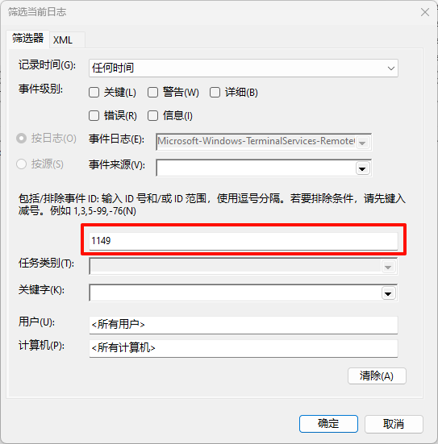
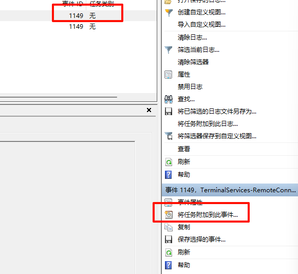

# Windows远程登录邮件提醒

为了防止有人在进行非法的远程登录桌面，在Windows记录到远程登录操作时自动触发邮件提醒脚本，并将登录情况发送邮件到指定邮箱，同时做好本地记录。

打开Windows自带的`事件查看器`，选择`应用程序和服务日志`-->`Microsoft`-->`Windows`-->`TerminalServices-RemoteConnectionManager`-->`Operational`

选择`筛选当前日志`在事件ID中填入`1149`

选中任意ID为`1149`的事件，在右侧找到`将任务附加到此事件`

选择启动程序，并选择python脚本路径即可
